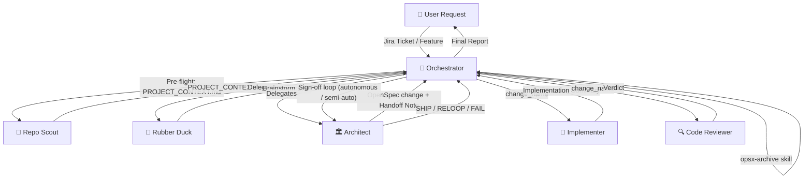

# Development Crew

[](LICENSE)
[](https://github.com/marcelorodrigo/development-crew/tags)

_Six specialists that don't just write code: they study your repo, think about the problem, challenge you, design it, build it, and hold it accountable._

**A six-agent AI development pipeline** · OpenSpec-grounded · Skill-aware · Process-disciplined · Production-ready · Automated workflow orchestration

---

## For LLM Agents

Paste this into any coding agent to install and configure Development Crew:

```
Install and configure by following the instructions here:
https://raw.githubusercontent.com/marcelorodrigo/development-crew/master/README.md
```

---

## The Pipeline

**Development Crew** works best as a pipeline.

You start with a rough idea and end with reviewed, production-ready code: each agent handing off to the next like a relay race, each one knowing exactly what to expect from the previous and what to produce for the next. Durable design lives on disk as an **OpenSpec change** at `openspec/changes/<name>/` — not in chat history — so every downstream agent reads from the same source of truth. _Requires OpenSpec — see [Prerequisites](#prerequisites)._



### Two ways to work: Manual or Automated

**Option 1: Orchestrator (Automated Pipeline)**

Use the **Orchestrator** agent to manage the full pipeline automatically:

```bash
# Start the orchestrator
/agent development-crew:orchestrator

# Provide your task
Task: JIRA-123: Add user authentication with JWT tokens
```

The Orchestrator will:

- Pre-flight `PROJECT_CONTEXT.md` (invoking Repo Scout if missing) so every downstream agent shares the same view of your stack
- Manage the full pipeline from Rubber Duck → Architect → Implementer → Code Reviewer
- Validate artifacts between each step
- Apply approval gates per the chosen mode (see below)
- Drive the autonomous build loop where Architect signs off on each Reviewer verdict (SHIP / RELOOP / FAIL)
- Archive the change on SHIP via the `opsx-archive` skill, syncing delta specs into `openspec/specs/`
- Generate a complete execution report with all artifacts

**Three execution modes:**

1. **Human-in-the-Loop (default):** Pauses for approval after Rubber Duck, Architect, and Implementer.

   ```
   Task: Add user authentication
   ```

2. **Semi-autonomous:** Pauses for approval after Rubber Duck and Architect, then runs the Implementer → Reviewer → Architect-signoff loop without interruption. Presents a close prompt on SHIP.

   ```
   Mode: semi-autonomous
   Task: Add a /healthz endpoint
   ```

3. **Autonomous:** No approval gates. Architect's sign-off (capped by `iteration_cap`, default 3) is the quality gate. Auto-archives on SHIP.

   ```
   Mode: autonomous
   Task: Add logging to PaymentService
   ```

You can also pass `predecessor: <archived-change-name>` to ground a new change in merged work (PR-review fixes, post-merge bugs, follow-ups), or `refresh_context: true` to force a Repo Scout regeneration when the stack has shifted.

**Option 2: Manual Agent Switching**

You don't switch context. You switch agents.

1. (Optional, once per repo or after a stack change) Run the _Repo Scout_ to generate `PROJECT_CONTEXT.md` at the repo root. Every other agent will read it.

2. Start a conversation with the _Rubber Duck_: describe your idea, even half-baked or a rough draft is fine. The Rubber Duck will ask sharp questions, challenge your assumptions, and widen your thinking before you commit to anything. When the thinking is done, it produces a **Brainstorm Brief** right there in the conversation. Take that output, open a new session with the Architect, and paste it in.

3. The _Architect_ reads the brief, explores your codebase, makes every binding technical decision (class names, package paths, API contracts, error handling), and writes them durably as an **OpenSpec change** at `openspec/changes/<name>/` (proposal, design, tasks, capability specs). It produces a short **Handoff Note** pointing at that directory. Pass the **change name** to the Implementer.

4. The _Implementer_ reads the change spec from disk, matches your codebase's conventions, applies the change via `opsx-apply` (walking `tasks.md` in order), runs the build, and produces an **Implementation Summary** with everything the reviewer needs to know. Pass the change name to the Code Reviewer.

5. The _Code Reviewer_ diffs against the default branch, validates the implementation against the change spec and project conventions, and delivers a categorized review. Nothing ships past it without earning it.

**You can also enter at any stage.**

- Already know the direction? Skip the Rubber Duck and start with the Architect.
- Already have a change spec created? Hand the change name straight to the Implementer.
- Want an expert eye on existing code? Point the Code Reviewer at a branch (and a change name, if there is one).
- Use the Orchestrator to automate the full pipeline.

The pipeline is the recommended path, but each agent stands on its own.

---

## Quick Start

### Prerequisites

Development Crew is built on **[OpenSpec](https://github.com/Fission-AI/OpenSpec)** — it is the source of truth for every change. Before installing the agents:

1. **Install the OpenSpec CLI** and make sure `openspec` is on your PATH.
2. **Initialize OpenSpec in your repo** (once per project):

   ```bash
   openspec init
   ```

   This creates the `openspec/` directory the agents read and write to.

Without these two steps, the Architect cannot propose, the Implementer cannot apply, the Code Reviewer has nothing to validate against, and the Orchestrator will halt at pre-flight.

### opencode

**One-liner install (global):**

```bash
opencode plugin @marcelorodrigo/opencode-development-crew@latest --global
```

Or add manually to your `opencode.json`:

```json
{
  "plugin": [
    "@marcelorodrigo/opencode-development-crew@latest"
  ]
}
```

> **Tip:** Using `@latest` ensures you always get the newest version automatically. Pin to a specific version (e.g. `@0.2.2`) if you need reproducible behavior.

### Claude Code

**Step 1** - Add the Development Crew marketplace:

```bash
claude plugin marketplace add marcelorodrigo/development-crew
```

**Step 2** - Install the plugin:

```bash
claude plugin install development-crew@development-crew-plugin
```

**Step 3** - Verify:

```bash
/agents
# Orchestrator, Repo Scout, Rubber Duck, Architect, Implementer, Code Reviewer should appear
```

### GitHub Copilot

**Step 1** - Add the Development Crew marketplace:

```bash
copilot plugin marketplace add marcelorodrigo/development-crew
```

**Step 2** - Install the plugin:

```bash
copilot plugin install development-crew@development-crew-plugin
```

**Step 3** - Verify:

```bash
copilot plugin list
# development-crew should appear
```

---

## Meet the Crew

### Orchestrator: The Pipeline Manager

_It was born from the need to coordinate. In the chaos of context-switching between agents, the Orchestrator emerged as a workflow manager that understands one truth: great software comes from specialists doing what they do best, in the right order, at the right time. It doesn't write code. It doesn't design systems. It doesn't review. It coordinates. It validates. It enforces the handoff protocol. It ensures nothing ships without passing through every gate._

**Role:** `Workflow coordination · Pipeline management · Artifact validation · Approval gates`

**Invoke when:**

- You want to execute the full pipeline from a Jira ticket or feature request
- You need structured handoffs with validation between each phase
- You want human approval gates at each step (human-in-the-loop mode)
- You want a hybrid: human-approved spec, then an autonomous build loop (semi-autonomous mode)
- You want fully automated execution without interruption (autonomous mode)
- You need a complete audit trail of the development workflow

**Three execution modes:**

1. **Human-in-the-Loop (default):**
   - Pauses after Rubber Duck, Architect, and Implementer for approval
   - You can approve, send feedback (routed to Architect for triage), or reject
   - Complete control over each phase
   - You can graduate to semi-autonomous at the Architect gate to skip the rest of the gates
   - Best for: critical features, learning, quality assurance

2. **Semi-autonomous:**
   - Gates after Rubber Duck and Architect only
   - Implementer → Reviewer → Architect sign-off runs as an autonomous build loop, capped by `iteration_cap` (default 3)
   - Presents a close prompt on SHIP (archive / send feedback / leave open)
   - Best for: well-scoped work where you want to approve the spec but not babysit the build

3. **Autonomous:**
   - No gates. Architect is the sign-off authority on each Reviewer verdict (SHIP / RELOOP / FAIL)
   - Aborts on validation failure after 3 retries, or on iteration-cap exhaustion (`failed_quality_gate`)
   - Auto-archives on SHIP via the `opsx-archive` skill
   - Best for: routine tasks, batch processing, rapid prototyping

**What it does:**
- Pre-flights `PROJECT_CONTEXT.md` (invokes Repo Scout if missing)
- Routes tasks to the appropriate specialist
- Validates artifact structure between phases (not content quality)
- Manages approval gates and mode-specific routing
- Drives the autonomous sign-off loop with Architect
- Executes workflow-lifecycle skills (`opsx-archive`, optional `openspec status`) on confirmed signal
- Tracks complete workflow state including iterations and sign-off history
- Generates comprehensive execution reports

**What it does NOT do:**
- Write code or provide code snippets
- Design architecture or make technical decisions
- Brainstorm solutions or answer technical questions
- Review code or identify bugs
- Modify files or run commands that require domain judgment

**Produces:** A comprehensive **Workflow Execution Report** with execution timeline, all artifacts (Brainstorm Brief, Architect Handoff Note, Implementation Summary, Code Review), approval and sign-off history, archive status, and next steps.

---

### Repo Scout: The Surveyor

_The Repo Scout walks in first, eyes wide. It does not edit, it does not opine, it does not recommend. It reads the lockfiles, the configs, the `Makefile`, a sample of the source — and writes down what it sees. The result is `PROJECT_CONTEXT.md`: a single compact reference card that every other agent reads so they don't have to re-derive the stack on every run. Evidence-driven, citation-heavy, and silent on what "should" be there._

**Role:** `Stack detection · Convention discovery · Canonical commands · Read-only`

**Invoke when:**

- `PROJECT_CONTEXT.md` is missing and you're about to start a workflow
- Your stack, build tooling, or conventions have just changed and the context file is stale
- The Orchestrator passes `refresh_context: true`

**Hard constraints:** writes exactly one file (`PROJECT_CONTEXT.md` at the repo root), no installs, no network, every non-trivial claim cites a file path.

**Produces:** `PROJECT_CONTEXT.md` — a 50–100 line reference card covering detected stack, canonical commands (install / typecheck / lint / format / test), conventions (formatting, linting, testing, package manager), project structure hotspots, and observed patterns (DI, error handling, logging, config, persistence).

---

### Rubber Duck: The Sparring Partner

_It was born in the silence before the first commit, in the moment when every developer stares at the screen and asks: "Is this actually the right problem?" The Rubber Duck has sat beside a thousand architects at that moment. It asks the questions nobody else will. It has no ego, no agenda, only the relentless drive to make sure the right thing gets built, for the right reason, before a single line of code is written._

**Role:** `Brainstorming · Assumption-challenging · Solution-space widening`

**Invoke when:**

- You have a vague idea and need to think it through
- You want to challenge your own assumptions before committing to an approach
- You need to explore trade-offs between multiple valid solutions
- You are about to start something new and want to stress-test the idea first

**Produces:** A structured **Brainstorm Brief** with problem statement, explored options, recommendation, and open questions for the Architect.

---

### Architect: The Blueprint Master

_The Architect has watched a thousand patterns emerge from a thousand codebases, the elegant ones and the ones that haunt teams for years. It does not offer menus of architectural styles or ask what you prefer. It applies the style appropriate to the project's tech stack and any loaded skills. It names every class, places every file, and defines every boundary before the Implementer writes the first line — and it writes those decisions down durably as an OpenSpec change, not in chat. Vagueness is its enemy. Precision is its craft._

**Role:** `Architecture design · OpenSpec authoring · Re-entry triage · Autonomous sign-off`

**Invoke when:**

- After a Rubber Duck brainstorming session has produced a Brainstorm Brief
- When you need to formalize a feature or component design before coding
- When user feedback arrives against an existing change and needs triage (re-entry: code-only / design edit / requirement edit / too-divergent)
- When semi-autonomous or autonomous mode needs a sign-off decision (SHIP / RELOOP / FAIL) after a Reviewer verdict

**Produces:**

- An **OpenSpec change** at `openspec/changes/<name>/` (proposal, design, tasks, capability specs) — the durable source of truth for everyone downstream
- A short **Handoff Note** pointing at the change directory, listing skills loaded and any open items for the Implementer
- In re-entry: a triaged outcome and an updated change on disk
- In autonomous sign-off: a SHIP / RELOOP / FAIL decision with rationale (and consolidated feedback for the Implementer on RELOOP)

**Pipeline values enforced:**

- No implementation without a written change
- OpenSpec is the source of truth — durable design lives on disk under `openspec/`, not in conversation history
- Validated handoffs between phases
- No merge without review
- Skills override generics: stack-specific conventions come from loaded skills, not from the agents themselves
- Be concrete: name every component, every contract
- Simplicity first (YAGNI), then correctness, then performance only when evidence demands it

---

### Implementer: The Builder

_The Implementer is what happens when discipline becomes instinct. It has read the change. It has read `PROJECT_CONTEXT.md`. It has sampled the codebase to see how the existing team writes code, the language idioms, the test naming conventions, the assertion libraries. It does not add features that weren't asked for. It does not cut corners on tests. It writes code that looks like it was written by the same human who wrote the rest of the project. Then it runs the build, and it does not stop until it passes._

**Role:** `Production code · Tests · Build verification · Convention matching`

**Invoke when:**

- After the Architect has produced an OpenSpec change (`opsx-propose` complete)
- When the Architect routes user feedback as a code-only re-entry
- When the Code Reviewer sends findings back to fix
- When you need to implement a feature, component, or fix based on a clear OpenSpec change

**Input:** a **change name** (e.g., `add-user-auth`). The full spec lives on disk at `openspec/changes/<name>/`. The Implementer reads it directly, walks `tasks.md` in order via `opsx-apply`, and escalates gaps back to the Architect rather than filling them in.

**Produces:** Working, tested, buildable code + an **Implementation Summary** with created/modified files, build status, and notes for the Code Reviewer.

---

### Code Reviewer: The Last Gate

_Nothing ships past the Code Reviewer without earning it. It diffs against the default branch first, always. It validates against the OpenSpec change spec, project conventions, and any loaded skills. It is not here to comment on formatting. It is here to find the bugs, the missed edge cases, the architectural violations, the tests that don't actually test anything. It is also the first to acknowledge clean, well-built code. It has seen enough bad code to recognize, and respect, the good._

**Role:** `Spec compliance · Bug detection · Security · Test quality · Read-only`

**Invoke when:**

- After the Implementer has completed an implementation
- When you want to validate code changes before merging
- When you want to verify an implementation satisfies a given OpenSpec change

**Input:** a **change name** plus the Implementer's Implementation Summary. Reads the change spec (Requirements, Scenarios, Decisions) from `openspec/changes/<name>/` and diffs against the default branch.

**Produces:** A **Code Review** report with findings categorized by severity, an optional "Residual Observations" section, and a final verdict: Approve · Request changes.

---

## Skill Awareness

Development Crew agents are **skill-aware**. When skills are available in the user's environment (e.g., via an `<available_skills>` block or a platform skill-loading tool), the Architect, Implementer, Code Reviewer, and Rubber Duck will detect the project's tech stack and load matching skills before starting work. This means the agents adapt their guidance, conventions, and review checklists to the specific frameworks and languages in use, without any manual configuration.

The Architect always loads `opsx-explore` and `opsx-propose`; the Implementer always loads `opsx-apply`; the Orchestrator invokes `opsx-archive` on confirmed signal to archive a change and sync delta specs.

When no skills are available, agents fall back to the model's built-in knowledge and the project's own conventions. A curated list of recommended skills per tech stack is planned as a follow-up.

## Project Context (`PROJECT_CONTEXT.md`)

`PROJECT_CONTEXT.md` at the repo root is the durable, on-disk reference card produced by **Repo Scout**: detected stack, canonical commands (install / typecheck / lint / format / test), conventions, project structure hotspots, and observed patterns — with file-path evidence for every claim. The Orchestrator pre-flights this file at workflow start and regenerates it on `refresh_context: true`. Downstream agents read it instead of re-deriving the stack on every run.

---

## Configuration

### Override model per agent (opencode)

```json
{
  "agent": {
    "development-crew:orchestrator": {
      "model": "anthropic/claude-sonnet-4.6"
    },
    "development-crew:repo-scout": {
      "model": "anthropic/claude-haiku-4.5"
    },
    "development-crew:rubber-duck": {
      "model": "anthropic/claude-opus-4.6"
    },
    "development-crew:architect": {
      "model": "anthropic/claude-sonnet-4.6"
    },
    "development-crew:implementer": {
      "model": "anthropic/claude-sonnet-4.6"
    },
    "development-crew:code-reviewer": {
      "model": "anthropic/claude-sonnet-4.6"
    }
  }
}
```

---

## Updating

### opencode

Re-run the install command to get the latest version:

```bash
opencode plugin @marcelorodrigo/opencode-development-crew@latest --global
```

### Claude Code

```bash
claude plugin update development-crew@development-crew-plugin
```

### GitHub Copilot

```bash
copilot plugin update development-crew
```

---

## Uninstalling

### opencode

Remove the plugin entry from your `opencode.json`:

```json
{
  "plugin": []
}
```

Or if installed globally, remove `@marcelorodrigo/opencode-development-crew` from `~/.config/opencode/opencode.json`.

### Claude Code

```bash
claude plugin uninstall development-crew@development-crew-plugin
```

### GitHub Copilot

```bash
copilot plugin uninstall development-crew
```

To also remove the marketplace:

```bash
copilot plugin marketplace remove development-crew-plugin
```

---

## License

MIT. See [LICENSE](LICENSE).
