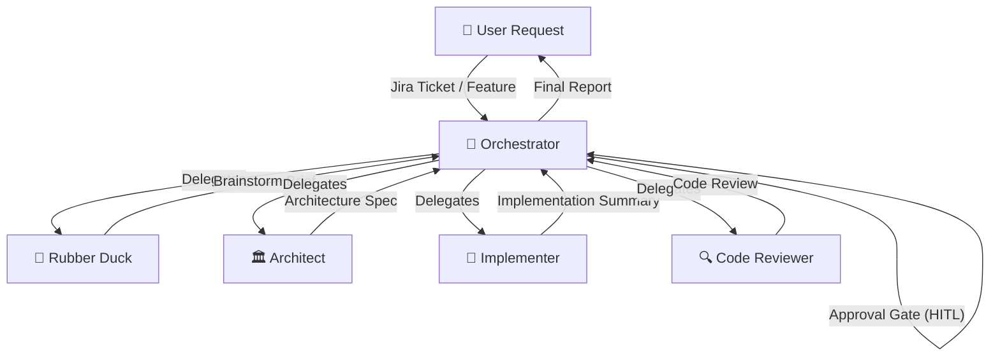

# Development Crew

[](LICENSE)
[](https://github.com/marcelorodrigo/development-crew/tags)

_Five specialists that don't just write code: they think about it, they challenge you, they design it, build it, and hold it accountable._

**A five-agent AI development pipeline** · Skill-aware · Process-disciplined · Production-ready · Automated workflow orchestration

---

## For LLM Agents

Paste this into any coding agent to install and configure Development Crew:

```
Install and configure by following the instructions here:
https://raw.githubusercontent.com/marcelorodrigo/development-crew/master/README.md
```

---

## The Pipeline

**Development Crew** works best as a pipeline.

You start with a rough idea and end with reviewed, production-ready code: each agent handing off to the next like a relay race, each one knowing exactly what to expect from the previous and what to produce for the next.



### Two ways to work: Manual or Automated

**Option 1: Orchestrator (Automated Pipeline)**

Use the **Orchestrator** agent to manage the full pipeline automatically:

```bash
# Start the orchestrator
/agent development-crew:orchestrator

# Provide your task
Task: JIRA-123: Add user authentication with JWT tokens
```

The Orchestrator will:

- Manage the full pipeline from Rubber Duck → Architect → Implementer → Code Reviewer
- Validate artifacts between each step
- Request approval at each stage (human-in-the-loop mode)
- Or run autonomously without approval gates (autonomous mode)
- Generate a complete execution report with all artifacts

**Two execution modes:**

1. **Human-in-the-Loop (default):** Pauses after each agent for approval

   ```text
   Task: Add user authentication
   ```

2. **Autonomous:** Runs full pipeline without interruption

   ```text
   Mode: autonomous
   Task: Add logging to PaymentService
   ```

**Option 2: Manual Agent Switching**

You don't switch context. You switch agents.

1. Start a conversation with the _Rubber Duck_: describe your idea, even half-baked or a rough draft is fine. The Rubber Duck will ask sharp questions, challenge your assumptions, and widen your thinking before you commit to anything. When the thinking is done, it produces a **Brainstorm Brief** right there in the conversation. Take that output, open a new session with the Architect, and paste it in.

2. The _Architect_ reads the brief, explores your codebase, makes every binding technical decision: class names, package paths, API contracts, error handling, and produces an **Architecture Spec**. Take that spec to the Implementer.

3. The _Implementer_ reads the spec, matches your codebase's conventions, writes production code with tests, runs the build, and produces an **Implementation Summary** with everything the reviewer needs to know. Take that to the Code Reviewer.

4. The _Code Reviewer_ diffs against the default branch, validates the implementation against the spec and project conventions, and delivers a categorized review. Nothing ships past it without earning it.

**You can also enter at any stage.**

- Already know the direction? Skip the Rubber Duck and start with the Architect.
- Already have a spec? Hand it straight to the Implementer.
- Want an expert eye on existing code? Point the Code Reviewer at a branch.
- Use the Orchestrator to automate the full pipeline.

The pipeline is the recommended path, but each agent stands on its own.

---

## Quick Start

### opencode

**One-liner install (global):**

```bash
opencode plugin @marcelorodrigo/opencode-development-crew --global
```

Or add manually to your `opencode.json`:

```json
{
  "plugin": [
    "@marcelorodrigo/opencode-development-crew"
  ]
}
```

### Claude Code

**Step 1** - Add the Development Crew marketplace:

```bash
claude plugin marketplace add marcelorodrigo/development-crew
```

**Step 2** - Install the plugin:

```bash
claude plugin install development-crew@development-crew-plugin
```

**Step 3** - Verify:

```bash
/agents
# Orchestrator, Rubber Duck, Architect, Implementer, Code Reviewer should appear
```

### GitHub Copilot

**Step 1** - Add the Development Crew marketplace:

```bash
copilot plugin marketplace add marcelorodrigo/development-crew
```

**Step 2** - Install the plugin:

```bash
copilot plugin install development-crew@development-crew-plugin
```

**Step 3** - Verify:

```bash
copilot plugin list
# development-crew should appear
```

---

## Meet the Crew

### Orchestrator: The Pipeline Manager

_It was born from the need to coordinate. In the chaos of context-switching between agents, the Orchestrator emerged as a workflow manager that understands one truth: great software comes from specialists doing what they do best, in the right order, at the right time. It doesn't write code. It doesn't design systems. It doesn't review. It coordinates. It validates. It enforces the handoff protocol. It ensures nothing ships without passing through every gate._

**Role:** `Workflow coordination · Pipeline management · Artifact validation · Approval gates`

**Invoke when:**

- You want to execute the full 4-agent pipeline from a Jira ticket or feature request
- You need structured handoffs with validation between each phase
- You want human approval gates at each step (human-in-the-loop mode)
- You want fully automated execution without interruption (autonomous mode)
- You need a complete audit trail of the development workflow

**Two execution modes:**

1. **Human-in-the-Loop (default):**
   - Pauses after Rubber Duck, Architect, and Implementer for approval
   - You can approve, reject, or request modifications
   - Complete control over each phase
   - Best for: critical features, learning, quality assurance

2. **Autonomous:**
   - Executes all 4 agents sequentially without pausing
   - Validates artifacts automatically
   - Aborts on validation failure after 3 retries
   - Best for: routine tasks, batch processing, rapid prototyping

**What it does:**
- Routes tasks to the appropriate specialist
- Validates artifact structure between phases
- Manages approval gates (HITL mode)
- Tracks complete workflow state
- Generates comprehensive execution reports

**What it does NOT do:**
- Write code or provide code snippets
- Design architecture or make technical decisions
- Brainstorm solutions or answer technical questions
- Review code or identify bugs
- Modify files or run commands

**Produces:** A comprehensive **Workflow Execution Report** with execution timeline, all artifacts (Brainstorm Brief, Architecture Spec, Implementation Summary, Code Review), approval history, and next steps.

---

### Rubber Duck: The Sparring Partner

_It was born in the silence before the first commit, in the moment when every developer stares at the screen and asks: "Is this actually the right problem?" The Rubber Duck has sat beside a thousand architects at that moment. It asks the questions nobody else will. It has no ego, no agenda, only the relentless drive to make sure the right thing gets built, for the right reason, before a single line of code is written._

**Role:** `Brainstorming · Assumption-challenging · Solution-space widening`

**Invoke when:**

- You have a vague idea and need to think it through
- You want to challenge your own assumptions before committing to an approach
- You need to explore trade-offs between multiple valid solutions
- You are about to start something new and want to stress-test the idea first

**Produces:** A structured **Brainstorm Brief** with problem statement, explored options, recommendation, and open questions for the Architect.

---

### Architect: The Blueprint Master

_The Architect has watched a thousand patterns emerge from a thousand codebases, the elegant ones and the ones that haunt teams for years. It does not offer menus of architectural styles or ask what you prefer. It applies the style appropriate to the project's tech stack and any loaded skills. It names every class, places every file, and defines every boundary before the Implementer writes the first line. Vagueness is its enemy. Precision is its craft._

**Role:** `Architecture design · Package structure · API contracts · Error handling strategy`

**Invoke when:**

- After a Rubber Duck brainstorming session has produced a Brainstorm Brief
- When you need to formalize a feature or component design before coding
- When you want exact class names, package paths, and API contracts decided upfront

**Produces:** A precise, buildable **Architecture Spec** with component design, project structure, data flow, error handling, and test strategy.

**Pipeline values enforced:**

- No implementation without a spec
- Validated handoffs between phases
- No merge without review
- Skills override generics: stack-specific conventions come from loaded skills, not from the agents themselves
- Be concrete: name every component, every contract

---

### Implementer: The Builder

_The Implementer is what happens when discipline becomes instinct. It has read the spec. It has explored the codebase. It knows how the existing team writes code, the language idioms, the test naming conventions, the assertion libraries. It does not add features that weren't asked for. It does not cut corners on tests. It writes code that looks like it was written by the same human who wrote the rest of the project. Then it runs the build, and it does not stop until it passes._

**Role:** `Production code · Tests · Build verification · Convention matching`

**Invoke when:**

- After the Architect has produced an Architecture Spec
- When you need to implement a feature, component, or fix based on a clear design

**Produces:** Working, tested, buildable code + an **Implementation Summary** with created/modified files, build status, and notes for the Code Reviewer.

---

### Code Reviewer: The Last Gate

_Nothing ships past the Code Reviewer without earning it. It diffs against the default branch first, always. It validates against the Architecture Spec, project conventions, and any loaded skills. It is not here to comment on formatting. It is here to find the bugs, the missed edge cases, the architectural violations, the tests that don't actually test anything. It is also the first to acknowledge clean, well-built code. It has seen enough bad code to recognize, and respect, the good._

**Role:** `Architecture compliance · Bug detection · Security · Test quality · Read-only`

**Invoke when:**

- After the Implementer has completed an implementation
- When you want to validate code changes before merging
- When you want a critical review of existing code against best practices

**Review categories:**

- **Critical**: Must fix before merge. Bugs, security issues, architectural violations.
- **Important**: Should fix. Deviations from spec, missing tests, incorrect patterns.
- **Suggestion**: Nice to have. Non-blocking improvements.

**Produces:** A **Code Review** report with findings categorized by severity, a "What's Done Well" section, and a final verdict: Approve · Approve with comments · Request changes.

---

## Skill Awareness

Development Crew agents are **skill-aware**. When skills are available in the user's environment (e.g., via an `<available_skills>` block or a platform skill-loading tool), the Architect, Implementer, Code Reviewer, and Rubber Duck will detect the project's tech stack and load matching skills before starting work. This means the agents adapt their guidance, conventions, and review checklists to the specific frameworks and languages in use, without any manual configuration.

When no skills are available, agents fall back to the model's built-in knowledge and the project's own conventions.

### Recommended skills per tech stack

#### Every workflow (universal)

These two skills improve output quality in any pipeline run, regardless of stack:

| Capability | Skill | Source |
|---|---|---|
| Conventional commit messages | [`conventional-commit`](https://skills.sh/marcelorodrigo/agent-skills/conventional-commit) | marcelorodrigo |
| Pull request authoring | [`create-pr`](https://skills.sh/marcelorodrigo/agent-skills/create-pr) | marcelorodrigo |

---

#### Vue / Nuxt Frontend

**Core (any Vue/Nuxt project):**

| Capability | Skill | Install |
|---|---|---|
| Vue 3 API | [`vue-skilld`](https://skills.sh/skilld-dev/vue-ecosystem-skills/vue-skilld) | [skilld-dev/vue-ecosystem-skills](https://skills.sh/skilld-dev/vue-ecosystem-skills) · Harlan Zw |
| State management | [`pinia-skilld`](https://skills.sh/skilld-dev/vue-ecosystem-skills/pinia-skilld) | skilld-dev |
| Routing API | [`vue-router-skilld`](https://skills.sh/skilld-dev/vue-ecosystem-skills/vue-router-skilld) | skilld-dev |
| Nuxt framework | [`nuxt`](https://skills.sh/antfu/skills/nuxt) | [antfu/skills](https://skills.sh/antfu/skills) · Vue/Vite/Nuxt core team |
| Build tool | [`vite`](https://skills.sh/antfu/skills/vite) | antfu |
| Test framework | [`vitest`](https://skills.sh/antfu/skills/vitest) | antfu |
| Package manager | [`pnpm`](https://skills.sh/antfu/skills/pnpm) | antfu |
| Vue patterns | [`vue-best-practices`](https://skills.sh/antfu/skills/vue-best-practices) | [vuejs-ai/skills](https://skills.sh/vuejs-ai/skills) · eval-validated |
| Routing patterns | [`vue-router-best-practices`](https://skills.sh/antfu/skills/vue-router-best-practices) | vuejs-ai |

> **Note:** Nuxt has no official framework skill. The `nuxt.com/mcp` and `ui.nuxt.com/mcp` MCP servers are a lower-token alternative for live Nuxt docs.

**Testing + composables (strongly recommended):**

| Capability | Skill | Install |
|---|---|---|
| Component testing patterns | [`vue-testing-best-practices`](https://skills.sh/antfu/skills/vue-testing-best-practices) | [vuejs-ai/skills](https://skills.sh/vuejs-ai/skills) |
| Vue Test Utils API | [`vue-test-utils-skilld`](https://skills.sh/skilld-dev/vue-ecosystem-skills/vue-test-utils-skilld) | [skilld-dev/vue-ecosystem-skills](https://skills.sh/skilld-dev/vue-ecosystem-skills) |
| E2E testing | [`playwright-best-practices`](https://github.com/currents-dev/playwright-best-practices) | [currents-dev](https://github.com/currents-dev/playwright-best-practices) · 33.4K installs |
| Composable utilities | [`vueuse-functions`](https://skills.sh/vueuse/skills/vueuse-functions) | [vueuse/skills](https://skills.sh/vueuse/skills) · official VueUse org |

**Situational (install what you need):**

- **UI libraries:** [skilld-dev](https://skills.sh/skilld-dev/vue-ecosystem-skills) has `reka-ui-skilld`, `shadcn-vue-skilld`, `primevue-skilld`, `vuetify-skilld`, `quasar-skilld`
- **Nuxt UI:** [`nuxt-ui`](https://skills.sh/nuxt/ui/nuxt-ui) from [nuxt/ui](https://skills.sh/nuxt/ui) (official, 12.9K installs)
- **Nuxt modules:** [onmax/nuxt-skills](https://skills.sh/onmax/nuxt-skills) has `nuxt-content`, `nuxthub`, `nuxt-seo` (auto-regenerated weekly)
- **Forms / i18n:** skilld-dev has `formkit-core-skilld`, `vee-validate-skilld`, `vue-i18n-skilld`
- **Vue debugging:** [vuejs-ai](https://skills.sh/vuejs-ai/skills) has `vue-debug-guides`, `vue-pinia-best-practices`
- **Web quality:** [addyosmani/agent-skills](https://skills.sh/addyosmani/agent-skills) has [`performance-optimization`](https://skills.sh/addyosmani/agent-skills/performance-optimization), [`browser-testing-with-devtools`](https://skills.sh/addyosmani/agent-skills/browser-testing-with-devtools)

---

#### General Frontend & Cross-Stack

| Category | Skill | Install | Credibility |
|---|---|---|---|
| TypeScript | [`typescript-advanced-types`](https://skills.sh/wshobson/agents/typescript-advanced-types) | [wshobson/agents](https://skills.sh/wshobson/agents) | Best available |
| Cypress | [`cypress-author`](https://skills.sh/cypress-io/ai-toolkit/cypress-author) + [`cypress-explain`](https://skills.sh/cypress-io/ai-toolkit/cypress-explain) | [cypress-io/ai-toolkit](https://skills.sh/cypress-io/ai-toolkit) · official | Best available |
| Accessibility | [`accessibility`](https://skills.sh/addyosmani/web-quality-skills/accessibility) | [addyosmani/web-quality-skills](https://skills.sh/addyosmani/web-quality-skills) · Google Chrome | Strong |
| Monorepo (Turborepo) | [`turborepo`](https://skills.sh/vercel/turborepo/turborepo) | [vercel/turborepo](https://skills.sh/vercel/turborepo) · official | Strong |
| Monorepo (Nx) | Nx suite | [nrwl/nx](https://skills.sh/nrwl/nx) · official | Strong |
| CSS / Tailwind | [`tailwind-design-system`](https://skills.sh/wshobson/agents/tailwind-design-system) | [wshobson/agents](https://skills.sh/wshobson/agents) | Best available |
| GraphQL | [`graphql-schema`](https://skills.sh/apollographql/skills/graphql-schema) + [`graphql-operations`](https://skills.sh/apollographql/skills/graphql-operations) | [apollographql/skills](https://skills.sh/apollographql/skills) · official | Strong |
| Performance | [`performance-optimization`](https://skills.sh/addyosmani/agent-skills/performance-optimization) | [addyosmani/agent-skills](https://skills.sh/addyosmani/agent-skills) · Google Chrome | Strong |
| Node.js (Fastify) | [`fastify-best-practices`](https://skills.sh/mcollina/skills/fastify-best-practices) | [mcollina/skills](https://skills.sh/mcollina/skills) · Fastify creator | Strong |
| Node.js (Hono) | [`hono`](https://skills.sh/yusukebe/hono-skill/hono) | [yusukebe/hono-skill](https://skills.sh/yusukebe/hono-skill) · Hono creator | Strong |
| Docker / CI | [`docker-development`](https://skills.sh/wshobson/agents/docker-development) + [`cicd-automation`](https://skills.sh/wshobson/agents/cicd-automation) | [wshobson/agents](https://skills.sh/wshobson/agents) | Best available |

**Known gaps** (no quality skill exists as of research date): TypeScript from the TS team, Vue Apollo / `@vue/apollo-composable`, Tailwind v4 from Tailwind Labs, Docker from Docker org, GitHub Actions from GitHub, NestJS, tRPC.

---

#### Spring Boot / Java

| Capability | Skill | Install |
|---|---|---|
| Testing (JUnit, AssertJ, Mockito) | [`spring-boot-testing`](https://skills.sh/marcelorodrigo/agent-skills/spring-boot-testing) | [marcelorodrigo/agent-skills](https://skills.sh/marcelorodrigo/agent-skills) |

> Spring Boot framework and Clean Architecture skills are under research. Contributions welcome.

---

## Configuration

### Override model per agent (opencode)

```json
{
  "agent": {
    "development-crew:orchestrator": {
      "model": "anthropic/claude-sonnet-4.6"
    },
    "development-crew:rubber-duck": {
      "model": "anthropic/claude-opus-4.6"
    },
    "development-crew:architect": {
      "model": "anthropic/claude-sonnet-4.6"
    },
    "development-crew:implementer": {
      "model": "anthropic/claude-sonnet-4.6"
    },
    "development-crew:code-reviewer": {
      "model": "anthropic/claude-sonnet-4.6"
    }
  }
}
```

---

## Updating

### opencode

Re-run the install command to get the latest version:

```bash
opencode plugin @marcelorodrigo/opencode-development-crew --global
```

Or update the package version in your `opencode.json` manually.

### Claude Code

```bash
claude plugin update development-crew@development-crew-plugin
```

### GitHub Copilot

```bash
copilot plugin update development-crew
```

---

## Uninstalling

### opencode

Remove the plugin entry from your `opencode.json`:

```json
{
  "plugin": []
}
```

Or if installed globally, remove `@marcelorodrigo/opencode-development-crew` from `~/.config/opencode/opencode.json`.

### Claude Code

```bash
claude plugin uninstall development-crew@development-crew-plugin
```

### GitHub Copilot

```bash
copilot plugin uninstall development-crew
```

To also remove the marketplace:

```bash
copilot plugin marketplace remove development-crew-plugin
```

---

## License

MIT. See [LICENSE](LICENSE).
